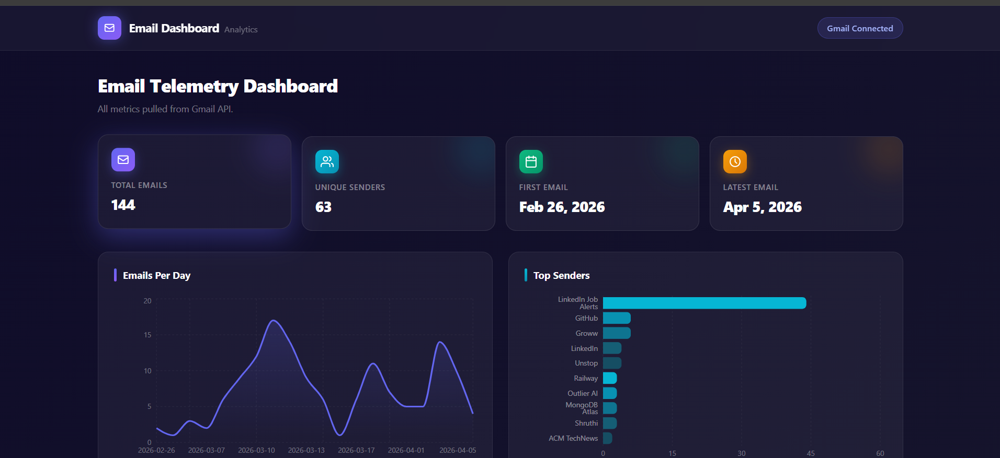
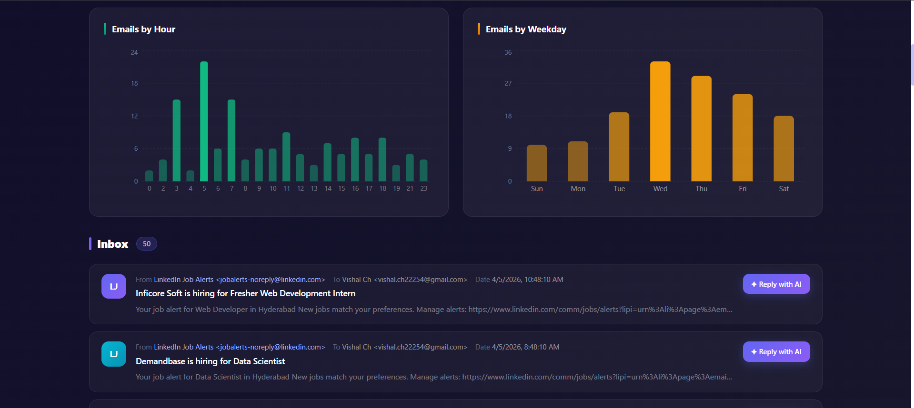
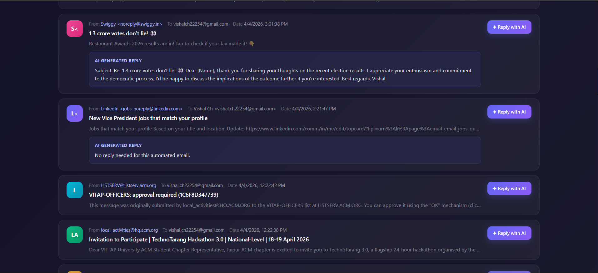

# Email Telemetry

A full-stack MERN dashboard for Gmail analytics and email telemetry.

This repository contains a React + Vite frontend and an Express + MongoDB backend. It connects to Gmail via OAuth, stores email metadata in MongoDB, caches analytics results in Redis, and exposes analytics endpoints for a rich dashboard experience.

## Features

- Gmail OAuth login via Google
- Fetches latest Gmail messages for authenticated users
- Stores email metadata in MongoDB for analytics and history
- Redis caching for improved performance on analytics endpoints
- Dashboard analytics including:
  - Total email summary
  - Email count per day
  - Top senders
  - Email volume by hour
  - Email volume by weekday
  - Recent email list
- Responsive React dashboard using Tailwind CSS and Recharts
- AI reply generation endpoint powered by Groq/OpenAI-compatible API

## Architecture

- `BACKEND/` - Express API server
  - `routes/auth.js` - Google OAuth login and callback flow
  - `routes/email.js` - Fetch Gmail email messages and store them
  - `routes/analytics.js` - Email analytics endpoints with Redis caching
  - `routes/ai.js` - AI-generated reply endpoint
  - `models/Email.js` - MongoDB email schema
  - `utils/googleAuth.js` - Google OAuth helper functions
  - `utils/cache.js` - caching helper wrapper
  - `redisClient.js` - Redis client connection
  - `db.js` - MongoDB connection helper
- `FRONTEND/` - React dashboard
  - `src/App.jsx` - main dashboard app logic and data loading
  - `src/services/api.js` - API client and endpoints
  - `src/components/` - dashboard UI components and visualizations

  ## 📸 Screenshots

### Dashboard Overview


---

### Analytics Section


---

### AI Reply Feature


## Technologies

- Backend:
  - Node.js
  - Express
  - MongoDB / Mongoose
  - Redis
  - Google APIs (`googleapis`)
  - OpenAI / Groq client
- Frontend:
  - React 19
  - Vite
  - Tailwind CSS
  - Recharts
  - Axios

## Setup

### 1. Backend

```bash
cd BACKEND
npm install
```

Create a `.env` file in `BACKEND/` with the following variables:

```env
PORT=3000
MONGO_URI=<your-mongodb-connection-string>
REDIS_URL=<your-redis-url>
GOOGLE_CLIENT_ID=<your-google-client-id>
GOOGLE_CLIENT_SECRET=<your-google-client-secret>
GOOGLE_REDIRECT_URI=http://localhost:3000/api/auth/callback
FRONTEND_URL=http://localhost:5173
GROQ_API_KEY=<your-groq-api-key>
```

Then start the backend:

```bash
npm start
```

### 2. Frontend

```bash
cd FRONTEND
npm install
```

Create a `.env` file in `FRONTEND/` with the API URL:

```env
VITE_API_URL=http://localhost:3000
```

Then start the frontend:

```bash
npm run dev
```

## Usage

1. Open the frontend app in your browser (usually `http://localhost:5173`).
2. Click the login button to start the Gmail OAuth flow.
3. After authorization, the dashboard will load Gmail analytics and email telemetry.
4. Use the logout button to clear the session.

## API Endpoints

### Authentication
- `GET /api/auth/url` - returns the Google OAuth URL
- `GET /api/auth/callback?code=...` - handles Google callback and redirects to frontend with token

### Email Fetching
- `GET /emails` - fetches recent Gmail messages for the logged-in user

### Analytics
- `GET /analytics/summary`
- `GET /analytics/emails-per-day`
- `GET /analytics/top-senders`
- `GET /analytics/emails-by-hour`
- `GET /analytics/emails-by-weekday`

### AI
- `POST /ai/reply` - generates a reply for an email using AI

## Notes

- The backend expects authenticated requests to include:
  - `Authorization: Bearer <access_token>`
  - `x-user-email: <user email>`
- Redis is used to cache analytics and email results for up to 10 minutes.
- MongoDB is used to persist email metadata and support aggregation.

## Deployment

- Deploy the backend on any Node-compatible host.
- Ensure MongoDB and Redis are available and reachable.
- Set `VITE_API_URL` in the frontend to the deployed backend URL.
- Configure Google OAuth credentials and authorized redirect URIs.

## Project Structure

- `BACKEND/`
  - `index.js`
  - `db.js`
  - `redisClient.js`
  - `models/Email.js`
  - `routes/`
  - `utils/`
- `FRONTEND/`
  - `src/`
  - `public/`
  - `package.json`

## License

This project is provided without warranty. Update the README with your preferred license if needed.
